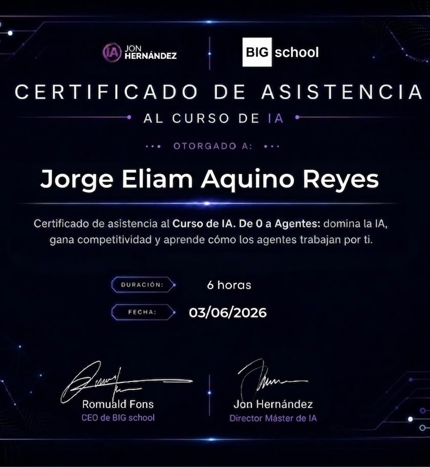
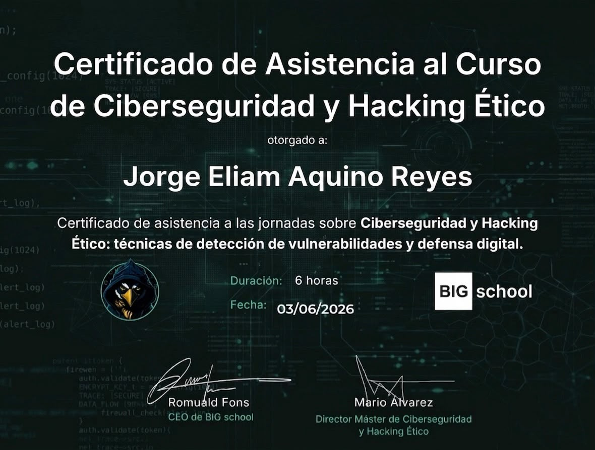
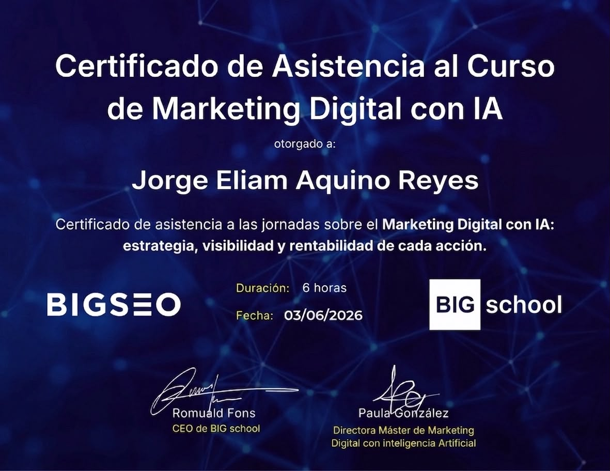
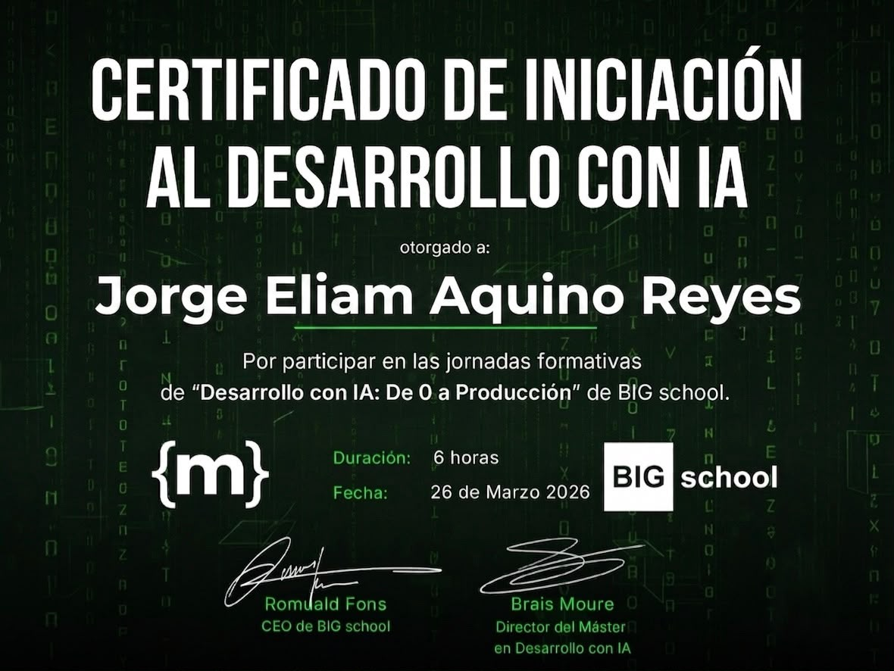
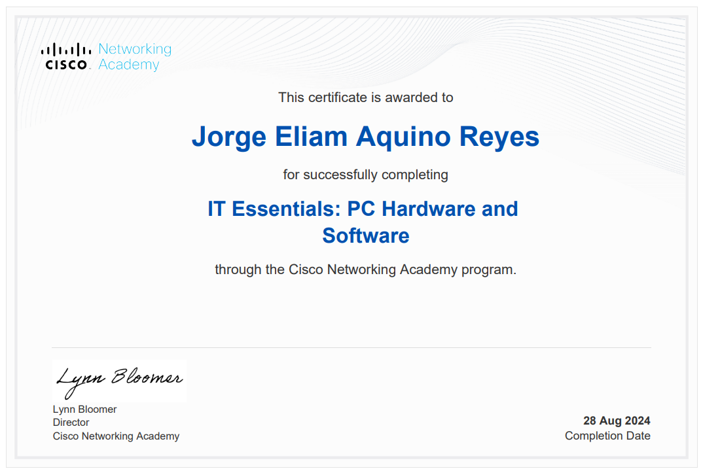

## 🧭 Sobre mí

Tengo 18 años y llevo 3 años formándome en **Fundación Kinal (2024–2026)**. No me quedé con un solo carril: construyo aplicaciones full-stack y, en paralelo, sumo IA aplicada, ciberseguridad y marketing digital al mismo stack — la idea es entender el producto completo, no solo el código.

- 🛠️ Trabajando en proyectos full-stack con **JavaScript, Java y C#**
- 🤖 Aprendiendo a integrar **agentes de IA** en flujos de desarrollo reales
- 🛡️ Metiéndole mano a fundamentos de **ciberseguridad y hacking ético**
- 📈 Entendiendo el lado de **marketing digital con IA** para no depender solo de "que funcione el código"
- 💬 Pregúntame de: desarrollo full-stack, automatización con agentes de IA, o cómo mezclar disciplinas sin perder foco
- ⚡ Dato random: prefiero tener un stack variado antes que una sola especialidad — versatilidad como ventaja competitiva

 

## 🧰 Stack técnico

**Lenguajes**
 

  

**Herramientas & flujo de trabajo**
 

  

**En expansión**

 

## 🎓 Certificaciones

| | |
|:---:|:---:|
|  |  |
| **Curso de IA: De 0 a Agentes** · BIG school × IA Jon Hernández · 6h · 03/06/2026 | **Ciberseguridad y Hacking Ético** · BIG school · 6h · 03/06/2026 |
|  |  |
| **Marketing Digital con IA** · BIG school (BIGSEO) · 6h · 03/06/2026 | **Desarrollo con IA: De 0 a Producción** · BIG school · 6h · 26/03/2026 |
|  | |
| **IT Essentials: PC Hardware and Software** · Cisco Networking Academy · 28/08/2024 | |

> 📁 Certificados originales disponibles en [`/certs`](./certs).

 

## 🚀 Proyectos destacados

| Proyecto | Stack | Descripción |
|---|---|---|
| [restaurantesybancario](https://github.com/jaquino-2021159/restaurantesybancario) | JavaScript | Sistema de gestión para restaurantes y banca |
| [kSports](https://github.com/jaquino-2021159/kSports) | JavaScript | Plataforma orientada a deportes |
| [client-user](https://github.com/jaquino-2021159/client-user) | JavaScript | Cliente web para gestión de usuarios |
| [AuthServiceIN6M-2021159](https://github.com/jaquino-2021159/AuthServiceIN6M-2021159) | C# | Servicio de autenticación |
| [Laboratorio2-Gestor-de-opiniones](https://github.com/jaquino-2021159/Laboratorio2-Gestor-de-opiniones) | JavaScript | Gestor de opiniones (laboratorio académico) |
| [AgendaWeb](https://github.com/jaquino-2021159/AgendaWeb) | HTML/CSS | Agenda web |

 

## 📊 Estadísticas

<picture>
  <source media="(prefers-color-scheme: dark)" srcset="https://raw.githubusercontent.com/jaquino-2021159/jaquino-2021159/output/github-snake-dark.svg" />
  
</picture>

 

